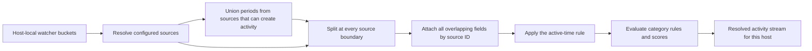
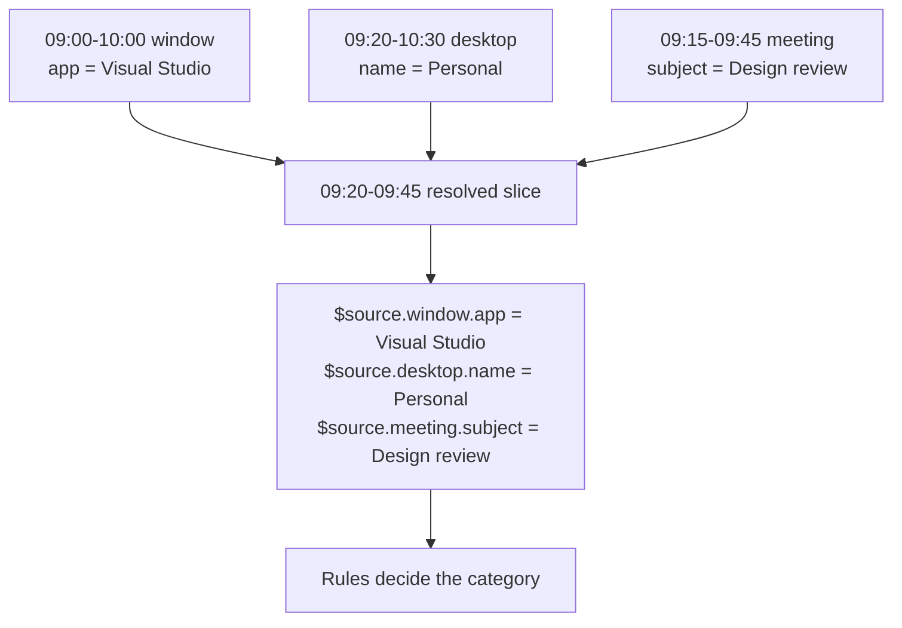

# Flexible Activity Model

ActivityWatch historically derived most reports from one window bucket, then filtered that stream with one AFK bucket. That works for standard desktop use, but it cannot naturally express the cases raised in [discussion #1169](https://github.com/orgs/ActivityWatch/discussions/1169): a virtual-desktop watcher that changes categorization, or a meeting watcher that contributes activity even while the computer is AFK.

The flexible model instead treats **activity as time with overlapping facts**, not as a privileged window event.

## Model

A **source** selects one or more watcher buckets for a device and exposes selected event fields. Its only activity-specific option is:

- **`creates_activity`** ("Can create activity periods"): its event intervals contribute to activity coverage.

Sources without this option can still be used by active-time and category rules, but cannot create reportable time by themselves. When sources overlap, no source takes precedence. Their fields coexist under `$source.<source-id>.<field>`, and the interval is split wherever any source starts or ends.

Simple mode generates an ordinary window source that auto-discovers each device's window bucket. It has no special precedence or root fields: its facts are namespaced like every other source, and Simple app/title predicates compile to an explicit reference to it. Advanced profiles can change its fields or buckets, make it context-only, or remove it. Merely having an `aw-watcher-window` bucket never adds coverage.

## In the UI

- **Simple** keeps the familiar app/title categories and automatic AFK behavior.
- **Advanced** adds sources, nested rules, weights, prerequisites, host limits, and custom active-time rules without changing the underlying model.
- **Can create activity periods** is a profile-wide source setting: it affects every report, not only the rule where it is changed.
- Active-time rules can remove covered time, but cannot create time where no activity-producing source has data.

For example, a window, meeting, and virtual-desktop watcher can all describe the same period:

## Rules and resolution

Active-time and category rules use the same expression shape:

- a predicate selects a source, one or more fields, a regular expression, optional negation, host, and match weight;
- **All (AND)** requires every child and adds their weights;
- **Any (OR)** requires one child and uses only the highest-scoring matched branch;
- nested groups provide parentheses;
- category prerequisites can require selected parent or ancestor rules to match.

The winning category is chosen by match score, then category tie-break priority, hierarchy depth, category-set priority, and definition order. Source order is not part of this decision. A negative predicate requires relevant source data to exist; missing data is not treated as a successful negative match.

The active-time rule masks within resolved coverage; it never creates time outside it.

Each host is resolved independently. Bucket ownership is checked before querying, so data does not leak across hosts. Host-scoped optional sources additionally use `query_bucket_optional(bucket, expected_hostname)` when the server advertises `query.query_bucket_optional.expected_hostname.v1`; a stale or manually entered bucket ID then returns no events unless its stored hostname matches. Older servers retain client-side ownership filtering. Resolved host streams are combined afterward using the existing device-order precedence.

Canonical resolution preserves original event intervals. Aggregation by app, title, or category happens only in report summaries, never before enrichment or categorization. On capable servers, stopwatch coverage enters the same pipeline before active-time masking; older servers retain their previous post-mask behavior as a compatibility path.

Reports expose the resolved stream as **activity**. Category and duration summaries work for every source shape. App/title summaries are only a presentation projection from an explicitly configured source that exposes those fields; browser focus likewise uses that source's namespaced `app` fact. If no suitable source exists, those optional summaries are empty rather than causing a window dependency.

## Compatibility and API impact

This is a query/settings migration, not a datastore migration. Existing buckets, events, watcher APIs, ingestion clients, and SQLite data remain unchanged.

The server info response adds an optional `capabilities` list. The Query2 HTTP endpoint is unchanged; namespaced overlap enrichment, active-period expressions, scored categorization and explanation, and the optional hostname argument are additive functions. Builders omit functions whose capabilities are absent, and old clients can ignore the additive field. A newer WebUI on an older server uses the legacy result and shows a non-blocking notice instead of failing.

Settings add `activity_profiles_v2` and `category_sets_v2` through the existing arbitrary-JSON settings API. Loading old settings creates the v2 model in memory; it is persisted only after an explicit save. Legacy `classes`, the predecessor category set, and AFK settings are refreshed as compatibility projections for older clients. Advanced rules that cannot be represented faithfully project to no rule rather than being silently flattened.

WebUI, Python, and Rust provide separate source-only v2 builders (`CanonicalQueryParamsV2`/`canonicalEventsV2`, and `CanonicalQueryV2Options`/`try_build_canonical_events_v2` in Rust). They accept explicit coverage, context, and active-time sources and never accept or synthesize `bid_window`, `bid_afk`, `legacy_window_mode`, or root `app`/`title`.

The older desktop builders remain explicit compatibility APIs for released servers and external callers. Their `bid_window`, `bid_afk`, `activity_sources`, `background_sources`, root aliases, and `"window"` report section are not mixed into the v2 path. The WebUI selects the source-only path when capabilities are present and adapts legacy results only at the old-server boundary. New integrations should use v2 builders, namespaced facts, and the generic `"activity"` report section.

Rust's public `QueryError` is now `#[non_exhaustive]` because datastore failures need distinct server-error classification. This is an intentional source-level change for exhaustive downstream matches: integrations must include a wildcard arm. `AdvancedQueryOptions` should likewise be constructed with `..Default::default()` so additive fields remain compatible.

The legacy Query2 string grammar cannot represent any query-bound string ending in an odd number of backslashes. Query builders now reject that case explicitly instead of emitting a corrupted query; a future versioned JSON wire grammar is required to remove this protocol limitation.

Advanced v2 evaluation still requires updated backend capabilities. Release packaging publishes updated `aw-core` and the Rust transform/query crates first; then updates and locks `aw-client`, `aw-server`, `aw-client-rust`, and `aw-server-rust`; then updates nested WebUI and `aw-server-rust` pins in Python, Rust, and Tauri distributions; and finally refreshes the top-level submodule pins. Capability discovery keeps mixed-version installations on the legacy path until that sequence is complete.
